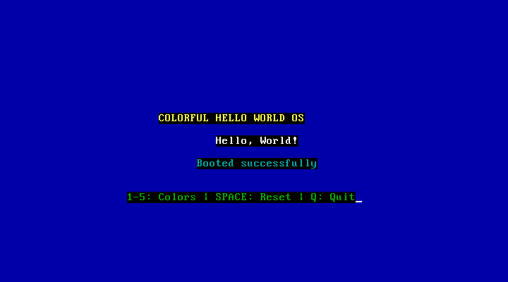
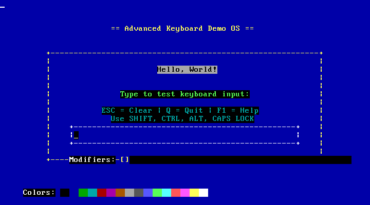
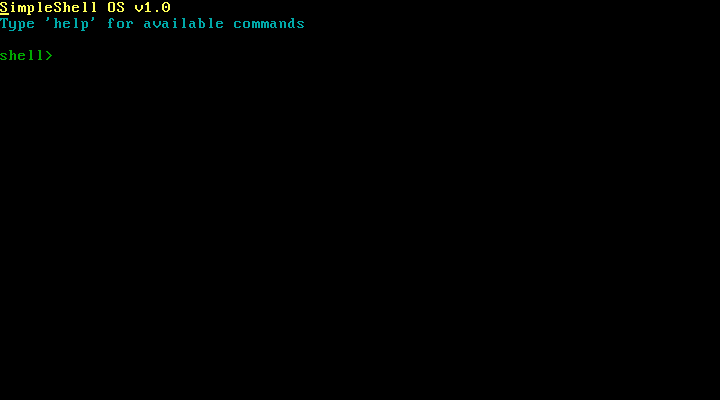
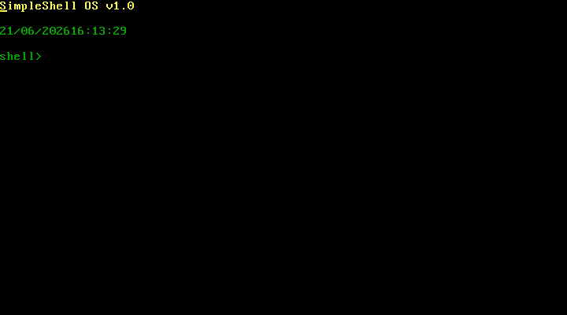
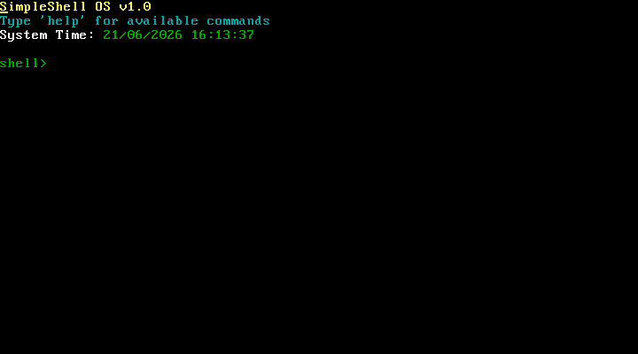

# MyOS-Simple

A progressive, bare-metal x86 operating-system tutorial in five self-contained
stages. Each stage is a complete, bootable image; each one adds exactly one
layer of capability on top of the previous. Read them in order and you watch an
operating system assemble itself from a single 512-byte boot sector into a
protected-mode C system with a command shell, a real-time clock, a cooperative
process model, and a fixed-point calculator.

Nothing here depends on an existing OS at runtime. Every image boots on the bare
machine (or QEMU) with only the BIOS beneath it.


## Contents

- [The five stages](#the-five-stages)
- [What it looks like](#what-it-looks-like)
- [What each stage teaches](#what-each-stage-teaches)
- [Design rationale](#design-rationale)
- [Architecture and memory layout](#architecture-and-memory-layout)
- [Prerequisites](#prerequisites)
- [Build and verification](#build-and-verification)
- [Quick start](#quick-start)
- [Repository layout](#repository-layout)
- [Conventions shared across the C stages](#conventions-shared-across-the-c-stages)
- [Known limitations](#known-limitations)
- [License](#license)


## The five stages

| # | Directory | Mode | Language | Lines (core) | Capability introduced |
|---|-----------|------|----------|--------------|-----------------------|
| 1 | `helloworld-os-asm`   | 16-bit real        | NASM      | 69 / 193 | Boot, print via BIOS, color + keyboard variant |
| 2 | `helloworld-os-c`     | 32-bit protected   | C + NASM  | 370 C    | Bootloader, GDT, real-to-protected switch, C kernel, direct VGA |
| 3 | `os-c-with-shell`     | 32-bit protected   | C + NASM  | 307 C    | Port-polled keyboard, interactive command shell (5 commands) |
| 4 | `helloworld-os-c-v2`  | 32-bit protected   | C + NASM  | 2084 C   | RTC/CMOS clock, process model, calculator, tab-completion, aliases (20 commands) |
| 5 | `helloworld-os-c-v3`  | 32-bit protected   | C + NASM  | 1894 C   | Consolidated command set (18 commands), committed build artifacts |

Line counts are the core source of each stage: for stage 1 the monochrome and
color assembly variants; for the C stages the kernel/shell plus the `process`
and `rtc` modules where present. The complexity gradient runs from 69 lines of
assembly that print a string to a ~1,900-line C system that tells the time, runs
cooperative tasks, and evaluates expressions, all without a standard library.


## What it looks like

Captured from QEMU. Each image is the unmodified output of the corresponding
stage's `make run`.

Stage 1 — color/keyboard boot sector (`make run-color`):



Stage 2 — first C kernel in protected mode, direct VGA, polled keyboard:



Stage 3 — the interactive command shell:



Stage 4 — shell with the CMOS real-time clock:



Stage 5 — the stabilized release, shell plus live system time:




## What each stage teaches

1. **Stage 1 — the boot-sector contract.** What the firmware actually requires:
   a 512-byte sector loaded to `0x7C00`, the `0xAA55` signature, 16-bit real
   mode, and the BIOS text/keyboard services (`int 0x10`, `int 0x16`). The color
   variant introduces VGA attribute bytes.
2. **Stage 2 — crossing into protected mode.** The Global Descriptor Table and
   segment descriptors, enabling protection via the `CR0.PE` bit, the far jump
   that flushes the prefetch and loads `CS`, linking freestanding code to a fixed
   load address, and writing the VGA framebuffer from C.
3. **Stage 3 — talking to hardware directly.** Polled 8042 keyboard I/O on ports
   `0x60`/`0x64`, Set-1 scancode decoding, and a hand-written command
   parser/dispatcher with no `libc` behind it.
4. **Stage 4 — what an OS actually does.** Reading the CMOS real-time clock and
   converting BCD fields, a process control block driven by a cooperative
   round-robin scheduler, fixed-point arithmetic without an FPU math library, and
   shell ergonomics (history, tab-completion, aliases).
5. **Stage 5 — stabilize and ship.** Consolidating the command surface, dropping
   the experimental detours, and committing the built binaries so the artifact
   that boots is the artifact in the repository.


## Design rationale

Each stage exists to answer the question the previous stage raised:

1. **What is actually underneath a "Hello, World"?** Strip away the runtime
   entirely. The BIOS loads the first 512 bytes of the disk to physical address
   `0x7C00`, executes them in 16-bit real mode, and the only services available
   are BIOS interrupts. The whole program fits in the boot sector and ends with
   the `0xAA55` signature the firmware checks for.
2. **How do we write the OS in a language we can grow?** Getting to C is the
   hard part, not the C itself: a hand-written bootloader installs a Global
   Descriptor Table, sets the protection-enable bit in `CR0`, far-jumps into
   32-bit protected mode, and calls a C entry point linked at a fixed address.
3. **How do we make the kernel interactive?** Read the keyboard controller
   directly (polling I/O ports `0x60`/`0x64`), decode scancodes, and dispatch a
   small command interpreter. There is no `libc`, so string handling and the
   prompt are written by hand.
4. **What does an operating system actually do?** Read wall-clock time from the
   CMOS RTC, model processes with a control block and a scheduler, perform
   fixed-point arithmetic without a math library, and make the shell ergonomic
   (history, tab-completion, aliases).
5. **How do we stabilize and ship?** Lock the command surface, drop the
   experimental detours, and commit the actual built binaries so the artifact
   that boots is the artifact in the repository.


## Architecture and memory layout

All C stages share the same physical memory plan. Paging is never enabled, so
these are physical addresses throughout.

```
 physical address
 0x00000  +-------------------------------+
          | Real-mode IVT + BIOS data     |
 0x00500  +-------------------------------+
          | (free low memory)             |
 0x01000  +-------------------------------+  <- kernel loaded here; linker places
          | Kernel image (.text/.data)    |     .text at 0x1000, exec starts here
          |   ...                         |
 0x07C00  +-------------------------------+  <- BIOS loads the 512-byte boot
          | Boot sector (512 B, 0xAA55)   |     sector here and runs it (real mode)
 0x07E00  +-------------------------------+
          | (free)                        |
 0x90000  +-------------------------------+  <- protected-mode stack top
          | Stack (grows downward)        |     (ESP/EBP), below the BIOS area
          +-------------------------------+
 0xB8000  +-------------------------------+  <- VGA text framebuffer, 80x25 cells,
          | Video memory (char + attr)    |     each cell = char byte + attr byte
 0xC0000  +-------------------------------+
```

The boot path from power-on to the C entry point:

```
 BIOS power-on self-test
        |
        v
 Load first sector (512 B) to 0x7C00, verify 0xAA55, jump in   [16-bit real mode]
        |
        v
 boot.asm: set DS/ES/SS and SP; BIOS int 0x13 (CHS) reads the
           kernel sectors from disk into 0x1000
        |
        v
 boot.asm: cli; lgdt [gdt_descriptor]; set CR0.PE = 1;
           far jump CODE_SEG:protected_entry
        |
        v
 reload data selectors with DATA_SEG; ESP = EBP = 0x90000       [32-bit protected mode]
        |
        v
 call 0x1000 -> kernel_entry.asm (_start) -> kernel_main()/shell_main()   [C]
        |
        v
 kernel writes VGA at 0xB8000, polls keyboard at 0x60/0x64, runs forever
```


## Prerequisites

The build is a freestanding 32-bit (`i386`) toolchain plus an emulator. On a
64-bit host you need the 32-bit multilib support for GCC.

Debian / Ubuntu:

```sh
sudo apt update
sudo apt install nasm gcc gcc-multilib binutils make qemu-system-x86
```

Fedora:

```sh
sudo dnf install nasm gcc glibc-devel.i686 libgcc.i686 binutils make qemu-system-x86
```

Arch:

```sh
sudo pacman -S nasm gcc lib32-glibc binutils make qemu-system-x86
```

Component roles:

- **nasm** — assembles boot sectors (`-f bin`, flat binary) and the 32-bit
  kernel entry stub (`-f elf32`).
- **gcc** — compiles the C kernel as freestanding 32-bit code (`-m32`).
- **ld** (binutils) — links the kernel to a fixed load address via `linker.ld`
  (`-m elf_i386`).
- **make** — drives each stage's build.
- **coreutils** — `cat` concatenates boot sector + kernel; `truncate` pads the
  image to a whole number of sectors.
- **qemu-system-x86_64** — boots the raw disk image.


## Build and verification

Every stage builds with `make` and boots in QEMU. The current tree was verified
against the following toolchain; older or newer versions generally work, but
these are the exact versions the build is known-good on:

| Component | Version tested |
|-----------|----------------|
| nasm      | 2.16.01 |
| gcc       | 13.3.0 (with `-m32` multilib) |
| ld        | 2.42 (GNU Binutils) |
| qemu      | 8.2.2 (`qemu-system-x86_64`) |
| make      | 4.3 |

Verified state: all five stages compile cleanly; all ten disk images carry a
valid `0xAA55` boot signature in their boot sector and boot in QEMU. Each stage's
bootloader reads a fixed number of sectors sized to its kernel:

| Stage | Image | Sectors loaded by `boot.asm` |
|-------|-------|------------------------------|
| 2 | `helloworld-os-c`    | 16 |
| 3 | `os-c-with-shell`    | 15 |
| 4 | `helloworld-os-c-v2` | 39 |
| 5 | `helloworld-os-c-v3` | 39 |


## Quick start

Each directory is independent and ships its own `Makefile` with consistent verbs:

```sh
cd helloworld-os-asm     # or any other stage
make                     # build the bootable image(s)
make run                 # boot the primary image in QEMU
make clean               # remove build artifacts
make help                # list available targets
```

The C stages also provide:

```sh
make run-simple          # boot the pure-assembly "simple" image
make debug               # boot under QEMU with a GDB stub (-s -S) on :1234
```

Stage 1 additionally provides `make run-color` for the color/keyboard variant.

To build every stage in one pass:

```sh
for d in helloworld-os-asm helloworld-os-c os-c-with-shell \
         helloworld-os-c-v2 helloworld-os-c-v3; do
    make -C "$d" clean && make -C "$d"
done
```


## Repository layout

```
MyOS-Simple/
├── README.md                 This file.
├── LICENSE                   MIT license.
├── docs/img/                 Screenshots used in this README.
├── helloworld-os-asm/        Stage 1 — pure assembly.
├── helloworld-os-c/          Stage 2 — C kernel in protected mode.
├── os-c-with-shell/          Stage 3 — interactive shell.
├── helloworld-os-c-v2/       Stage 4 — clock, processes, calculator.
└── helloworld-os-c-v3/       Stage 5 — stabilized release.
```

Each stage directory contains its own `README.md` documenting that stage in
detail. Stages 4 and 5 additionally ship `README_SHELL.md`, a complete
command reference for the shell.


## Conventions shared across the C stages

These hold for stages 2-5 and are documented once here rather than repeated:

- **Load address.** The bootloader loads the kernel to physical `0x1000` and the
  linker script places `.text` at `0x1000`, so execution begins at the first
  byte of the kernel image.
- **Stack.** Protected-mode `ESP`/`EBP` are initialized to `0x90000`, comfortably
  below the kernel and above the BIOS data area.
- **GDT.** A minimal three-entry table: a null descriptor, a flat ring-0 code
  segment, and a flat ring-0 data segment, each spanning the full 4 GiB with
  4 KiB granularity (`0xCF` flags). No paging is enabled.
- **Display.** Text is written directly to VGA memory at `0xB8000`; each cell is
  a character byte followed by an attribute byte (`background << 4 | foreground`).
- **Keyboard.** Input is read by polling the 8042 controller: status port
  `0x64`, data port `0x60`. Scancodes are translated through the tables in
  `keyboard.h`.
- **Freestanding C.** Compiled with `-ffreestanding -nostdlib -nostdinc
  -fno-builtin -fno-stack-protector -fno-pic -fno-pie`. There is no C runtime;
  the assembly entry stub calls the kernel's C entry point directly.


## Known limitations

- Real-mode disk loading uses BIOS `int 0x13` with CHS addressing and assumes
  the kernel occupies contiguous sectors starting at sector 2 of the boot media.
- The process model (stage 4+) is cooperative: tasks must call `process_yield()`.
  There is no timer-driven preemption and no memory protection between tasks.
- RTC reads are not synchronized against the update-in-progress flag, so a read
  that races a CMOS update may momentarily return an inconsistent field.
- Images are sized for QEMU; running on physical hardware may require adjusting
  the sector count loaded by the bootloader.


## License

Released under the MIT License. See [LICENSE](LICENSE) for the full text.
